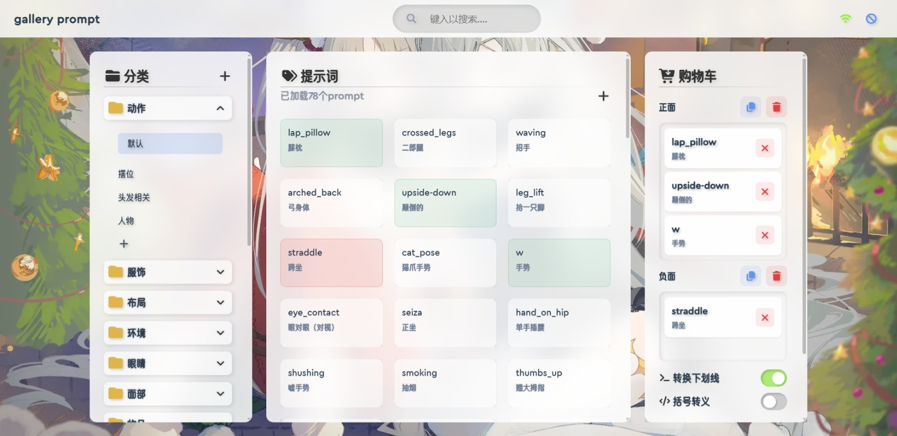

# Gallery Prompt



Gallery Prompt 是一个轻量级的提示词（Prompt）管理工具，专为 AI 绘画爱好者设计。它提供美观的毛玻璃界面，帮助您分类、搜索、收藏常用的提示词，并支持正面/负面提示词的快速组合与一键复制。

## 功能特点

- **多级分类管理**：采用「分类 - 子分类 - 提示词」的三层结构，组织清晰，管理直观。
- **实时搜索**：支持关键词搜索与模糊搜索，响应迅速，可搜索提示词内容及其翻译。
- **复制选项**：复制时可选处理下划线转义、括号转义，适配不同格式。
- **实时编辑**：前端可直接对分类和提示词进行添加、修改、删除操作，所见即所得。
- **自动保存**：所有修改均实时保存至本地 JSON 文件，并支持手动备份。

## 界面预览

- **主界面**：左侧分类树，中间提示词卡片，右侧“购物车”用于临时组合提示词。
- **导航栏**：中央搜索框（带节流优化），右侧显示**连接状态**及**开启新世界!!!**。
- **配色方案**：柔和毛玻璃效果。
- **图标**：采用 **FontAwesome 6 Free** 图标，清晰直观。
- **字体**：
  - 英文: **CeraRoundPro**
  - 中文: **优设鲨鱼菲特健康体**

## 安装与运行

### 环境要求

- Python 3.8+
- Flask
- python-Levenshtein（可选，提升搜索速度）

### 快速开始

1. 克隆:

   ```bash
   git clone https://github.com/Xcpmd/Gallery-Prompt-Library.git
   ```

2. 安装依赖：

   ```bash
   pip install -r requirements.txt
   ```

3. 启动服务：

   ```bash
   python app.py
   ```

   **可选参数**：
   - `--backup`：启用自动备份，备份文件保存在 `./prompts/backUp/` 目录。
   - `--debug`：开启 Flask 调试模式。

   或直接双击运行 `run.bat`（Windows）。

### 项目结构

```txt
Gallery-Prompt-Library
├── /static
│   ├── /scripts
│   │   └── main.js           # 前端主逻辑
│   ├── /styles
│   │   ├── ai.css            # 主样式表
│   │   ├── edit.css          # 弹窗编辑样式
│   │   └── all.min.css       # FontAwesome 图标库
│   ├── /webfonts             # 字体文件（含 FontAwesome 所需字体）
│   └── /images               # 背景图等静态资源
├── /templates
│   └── index.html            # 主页面模板
├── /public                   # 其他公共资源
├── /prompts
│   ├── /backUp               # 自动备份目录（启用 --backup 后生成）
│   └── *.json                # 提示词数据文件（默认存储）
├── app.py                    # Flask 后端应用
├── search.py                 # 搜索模块 :ai
├── requirements.txt
├── README.md
└── ...
```

## 注意事项

- 本项目为个人学习作品，作者为高二学生，前端水平有限，欢迎友好指教。
- 除 `search.py` 及个别算法外，其余代码均为手动编写，未使用 AI 生成。
- 当前版本**未做输入验证**，请勿使用 / : \* ? " < > | 等字符作为分类id

## 开源协议

[MIT LICENSE](https://mit-license.org/)
